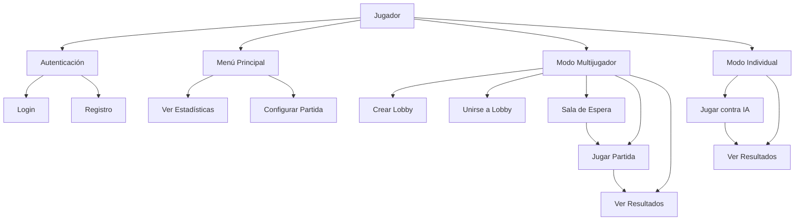
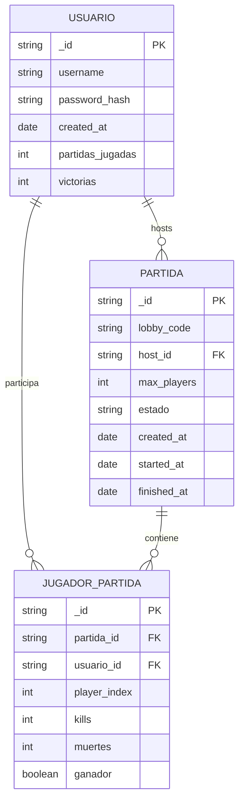
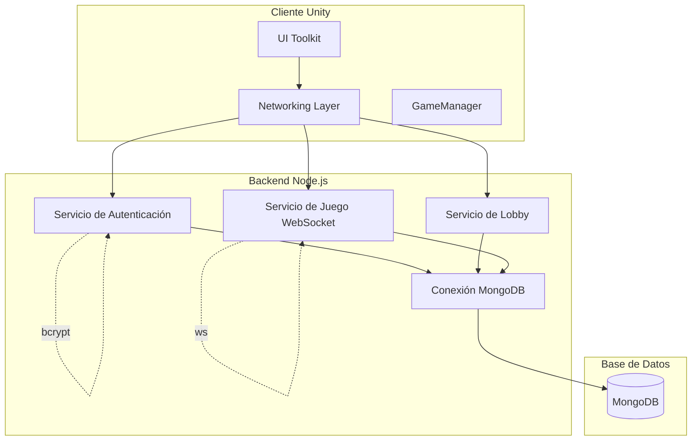
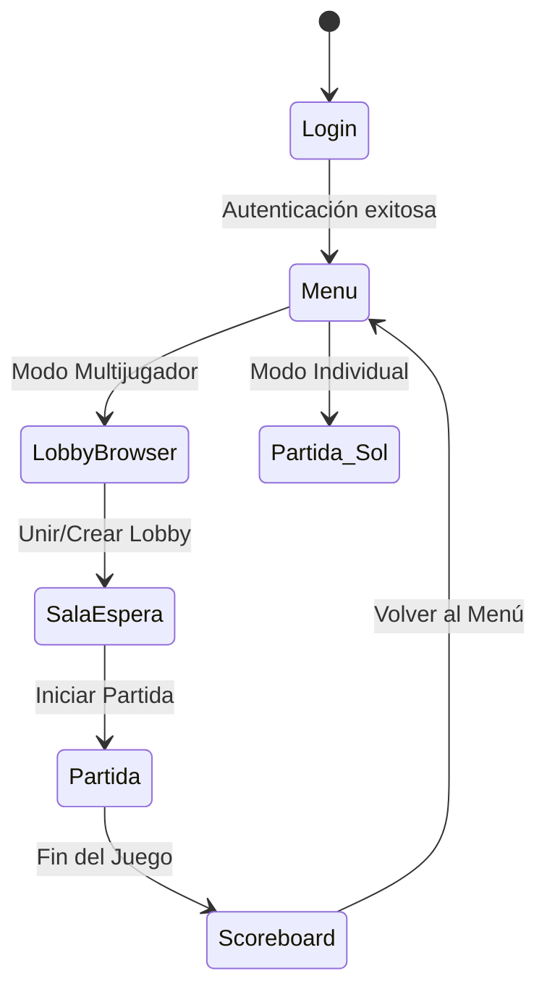

```markdown
# Bomberman Joc

**Integrantes:** Fabrizzio Rodriguez Gonzales  
**Nombre del Proyecto:** Bomberman Joc - Juego Multijugador  
**Petita Descripción:** Recreación moderna del clásico Bomberman con enfoque multijugador, arquitectura distribuida con backend Node.js y cliente Unity 2D. Soporta modo multijugador online en tiempo real y modo individual con IA entrenada mediante reinforcement learning.  
**Adreça del Gestor de Tasques:** [URL de Jira]  
**URL de Producción:** [URL cuando esté disponible]  
**Estado:** Desarrollo activo - Sistema multijugador funcional con lobby y partidas en tiempo real. Backend Node.js/Express completo con WebSocket para sincronización, cliente Unity 2D con UI Toolkit, y modo individual con ML-Agents. Base de datos MongoDB implementada para persistencia de usuarios e historial de partidas.

## Tecnologías

### Backend
- **Node.js / Express** - API REST y servidor WebSocket [1](#2-0) 
- **MongoDB** - Base de datos para usuarios e historial de partidas
- **WebSocket (ws)** - Comunicación en tiempo real para sincronización de juego
- **bcrypt** - Encriptación de contraseñas
- **dotenv** - Gestión de variables de entorno

### Frontend (Cliente Unity)
- **Unity 2022+** - Motor de juego 2D
- **UI Toolkit** - Sistema de interfaz basado en UXML/USS
- **ML-Agents** - IA para modo individual
- **ClientWebSocket** - Conexión nativa con servidor WebSocket [2](#2-1) 

## Diagramas

### 1. Casos de Uso



### 2. Entidad-Relación



### 3. Microservicios



## Arquitectura del Sistema

El proyecto sigue una arquitectura cliente-servidor con comunicación híbrida:

1. **REST API** - Para autenticación y gestión de lobbies
2. **WebSocket** - Para sincronización en tiempo real del juego
3. **PlayerPrefs** - Para persistencia de estado entre escenas Unity [3](#2-2) 

## Flujo de la Aplicación



## Instalación y Configuración

### Backend
```bash
cd servidor
npm install
cp .env.example .env
# Configurar variables de entorno
npm start
```

### Cliente Unity
1. Abrir proyecto en Unity 2022+
2. Configurar escenas en Build Settings
3. Ejecutar desde escena Login

## Variables de Entorno
- `MONGODB_URI` - URL de conexión a MongoDB
- `JWT_SECRET` - Clave para tokens de autenticación
- `PORT` - Puerto del servidor (default: 3000)
```

## Notes

El README completo incluye toda la información tecnológica relevante del proyecto basada en los archivos de código existentes. Los tres diagramas solicitados (casos de uso, entidad-relación y microservicios) reflejan la arquitectura real del sistema con backend Node.js/Express, cliente Unity y comunicación via REST/WebSockets. La estructura de datos está basada en el uso de MongoDB y la lógica de persistencia con PlayerPrefs observada en el código.

Wiki pages you might want to explore:
- [Project Overview (inspedralbes/tr3-joc-dawtr3gfabrizziorodriguez)](/wiki/inspedralbes/tr3-joc-dawtr3gfabrizziorodriguez#1)
- [Glossary (inspedralbes/tr3-joc-dawtr3gfabrizziorodriguez)](/wiki/inspedralbes/tr3-joc-dawtr3gfabrizziorodriguez#7)

### Citations
