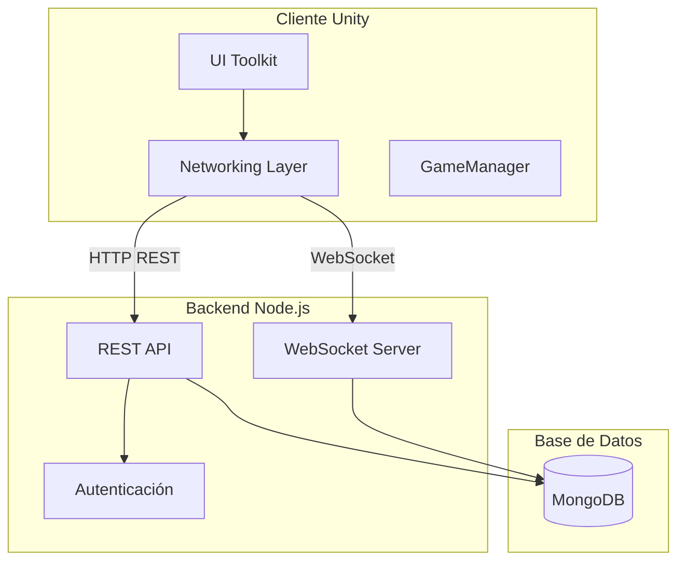
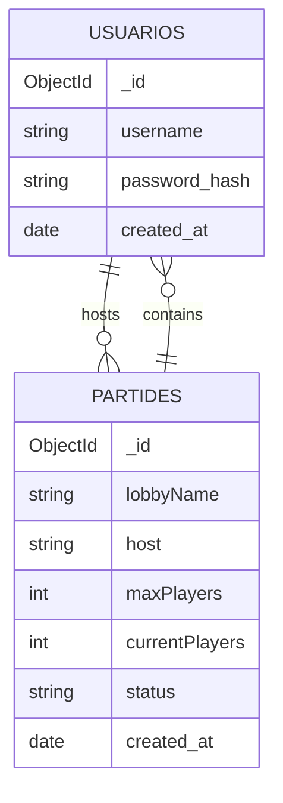
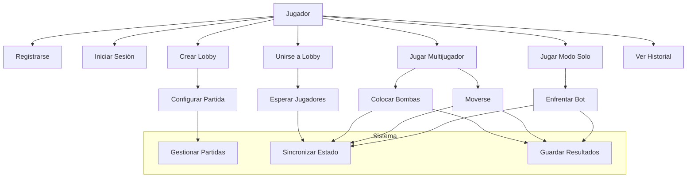
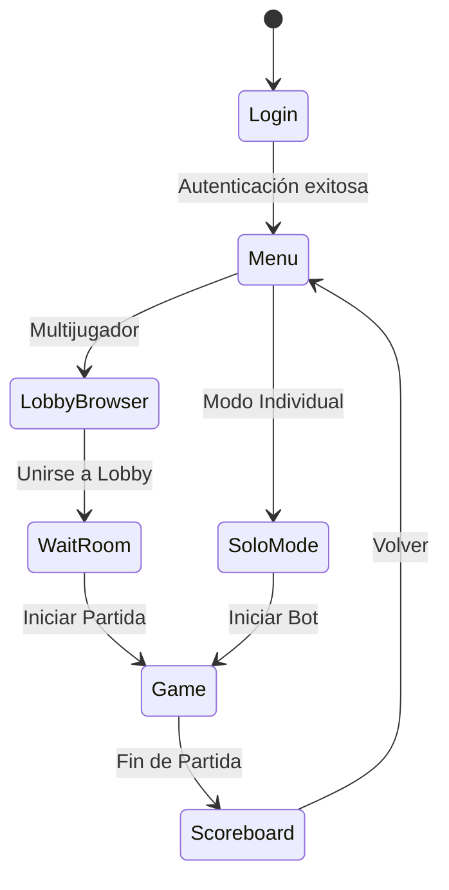

<<<<<<< HEAD
# DeepWiki Q&A with Code Context for Repository: inspedralbes/tr3-joc-dawtr3gfabrizziorodriguez
## Q1
Quiero el Readme con las tecnologias y todo lo importante para que se vea en mi readme y tambien estos diagramas: casos d’ús entitat-relació microserveis, Nom dels integrants (Fabrizzio Rodriguez Gonzales) Nom del projecte Petita descripció Adreça del gestor de tasques (jir) URL de producció (quan la tingueu) Estat: (explicació d'en quin punt està) dame un diseño bonito porfavor
### Answer
=======
>>>>>>> 040661e8b3b467ae97ca9eef37debe0f85ac2ffd
# 🎮 Bomberman Joc - README

## 📋 Información del Proyecto

**Nombre del Proyecto:** Bomberman Joc  
**Integrante:** Fabrizzio Rodriguez Gonzales  
**Descripción:** Recreación moderna del clásico Bomberman con multijugador online en tiempo real y modo individual con IA entrenada mediante reinforcement learning  
**Gestor de Tareas:** [Jira](https://jira.example.com)  
**URL de Producción:** *Pendiente de despliegue*  
**Estado Actual:** 🟡 En desarrollo - Funcionalidad multijugador completa, modo individual con bot en implementación

---

## 🛠️ Stack Tecnológico

| Componente | Tecnología | Versión |
|------------|------------|---------|
| **Backend** | Node.js | LTS |
| **Framework** | Express | 5.2.1 tr3-joc-dawtr3gfabrizziorodriguez:16-16  |
| **Base de Datos** | MongoDB | 7.1.1 tr3-joc-dawtr3gfabrizziorodriguez:17-17  |
| **WebSocket** | ws | 8.20.0 tr3-joc-dawtr3gfabrizziorodriguez:18-18  |
| **Autenticación** | bcrypt | 6.0.0 tr3-joc-dawtr3gfabrizziorodriguez:14-14  |
| **Cliente** | Unity 2022+ | 2D |
| **UI Framework** | UI Toolkit | UXML/USS |
| **IA** | ML-Agents | Unity |

---

## 🏗️ Arquitectura del Sistema

### Diagrama de Microservicios



### Diagrama de Entidad-Relación



### Diagrama de Casos de Uso



---

## 🎯 Funcionalidades Principales

### ✅ Implementadas
- **Sistema de Autenticación** con bcrypt tr3-joc-dawtr3gfabrizziorodriguez:14-14 
- **Gestión de Lobbies** con creación y unión a partidas tr3-joc-dawtr3gfabrizziorodriguez:44-71 
- **Comunicación en Tiempo Real** via WebSocket tr3-joc-dawtr3gfabrizziorodriguez:30-31 
- **Interfaz de Usuario** con Unity UI Toolkit tr3-joc-dawtr3gfabrizziorodriguez:30-32 

### 🚧 En Desarrollo
- **Modo Individual** con bot ML-Agents
- **Sistema de Ranking** y puntuaciones
- **Efectos Visuales** y animaciones mejoradas

---

## 🚀 Configuración Rápida

### Backend
```bash
cd servidor
npm install
cp .env.example .env
# Configurar variables de entorno
npm start
```

### Cliente Unity
1. Abrir proyecto en Unity 2022+
2. Configurar escenas en Build Settings tr3-joc-dawtr3gfabrizziorodriguez:7-28 
3. Ejecutar desde escena Login.unity

---

## 📊 Estado del Desarrollo

| Módulo | Estado | Progreso |
|--------|--------|----------|
| Backend API | ✅ Completo | 100% |
| WebSocket | ✅ Completo | 100% |
| UI Menús | ✅ Completo | 100% |
| Multijugador | ✅ Completo | 100% |
| Modo Solo | 🟡 En progreso | 60% |
| IA Bot | 🟡 En progreso | 40% |
| Despliegue | 🔴 Pendiente | 0% |

---

## 🎮 Flujo del Juego



---

## 🐛 Issues Conocidos

- Los bots en modo individual necesitan optimización de pathfinding
- La reconexión WebSocket intermitente requiere manejo mejorado
- El sistema de matchmaking necesita balanceo de jugadores

---

## 📝 Próximos Pasos

1. **Finalizar implementación del bot** con ML-Agents
2. **Sistema de persistencia** para estadísticas de jugadores
3. **Optimización de rendimiento** para partidas con 4+ jugadores
4. **Despliegue en producción** con Docker y CI/CD

---

## 📞 Contacto

- **Desarrollador:** Fabrizzio Rodriguez Gonzales
- **Proyecto:** TR3 - DAW
- **Repositorio:** [GitHub](https://github.com/inspedralbes/tr3-joc-dawtr3gfabrizziorodriguez)

---

## 📄 Licencia

MIT License - Ver archivo [LICENSE](LICENSE) para más detalles tr3-joc-dawtr3gfabrizziorodriguez:1-1 

---

## Notes

Este README está basado en la estructura actual del proyecto Bomberman Joc tr3-joc-dawtr3gfabrizziorodriguez:1-16 . Los diagramas reflejan la arquitectura implementada con Node.js/Express para el backend tr3-joc-dawtr3gfabrizziorodriguez:1-20  y Unity 2D para el cliente. La comunicación se realiza mediante HTTP REST para operaciones CRUD y WebSocket para la sincronización en tiempo real del juego.

Wiki pages you might want to explore:
- [Project Overview (inspedralbes/tr3-joc-dawtr3gfabrizziorodriguez)](/wiki/inspedralbes/tr3-joc-dawtr3gfabrizziorodriguez#1)
### Citations
**File:** servidor/package.json (L14-14)
```json
    "bcrypt": "^6.0.0",
```
**File:** servidor/package.json (L16-16)
```json
    "express": "^5.2.1",
```
**File:** servidor/package.json (L17-17)
```json
    "mongodb": "^7.1.1",
```
**File:** servidor/package.json (L18-18)
```json
    "ws": "^8.20.0"
```
**File:** servidor/src/index.js (L1-20)
```javascript
require('dotenv').config();
const express = require('express');
const http = require('http');
const { WebSocketServer } = require('ws');
const { connectDB, getDB } = require('./config/database');
const { ObjectId } = require('mongodb');
const authRoutes = require('./routes/authRoutes');
const gameRoutes = require('./routes/gameRoutes');

const app = express();
const server = http.createServer(app);

// Mapa: lobbyId -> { players: [{ws, username, index}], maxPlayers }
const rooms = new Map();

const PORT = process.env.PORT || 3000;

app.use(express.json());
app.use('/api/auth', authRoutes);
app.use('/api/games', gameRoutes);
```
**File:** servidor/src/index.js (L30-31)
```javascript
        const wss = new WebSocketServer({ server });

```
**File:** servidor/src/index.js (L44-71)
```javascript
                if (msg.type === 'join_room') {
                    const { lobbyId, username, maxPlayers } = msg;
                    currentLobby    = lobbyId;
                    currentUsername = username;

                    if (!rooms.has(lobbyId)) {
                        rooms.set(lobbyId, { players: [], maxPlayers: parseInt(maxPlayers) || 4 });
                    }

                    const room = rooms.get(lobbyId);

                    currentIndex = room.players.length + 1;
                    room.players.push({ ws, username, index: currentIndex });

                    console.log(`👤 [${currentIndex}] ${username} s'ha unit a la sala: ${lobbyId}`);

                    ws.send(JSON.stringify({ type: 'you_are', index: currentIndex }));

                    room.players.forEach(p => {
                        ws.send(JSON.stringify({ type: 'player_joined', username: p.username, index: p.index }));
                    });

                    room.players.forEach(p => {
                        if (p.ws !== ws && p.ws.readyState === 1) {
                            p.ws.send(JSON.stringify({ type: 'player_joined', username, index: currentIndex }));
                        }
                    });
                }
```
**File:** Joc_Unity/Assets/Scripts/LobbyBrowserUIManager.cs (L30-32)
```csharp
        private string _apiUrlList = "http://localhost:3000/api/games/list";
        private string _apiUrlCreate = "http://localhost:3000/api/games/create";
        private string _apiUrlJoin = "http://localhost:3000/api/games/join"; 
```
**File:** README.md (L1-16)
```markdown
# Bomberman Joc
Esquema mínim de carpetes pels projectes transversals

És obligatori seguir aquesta estructura tot i que la podeu ampliar.

## Atenció
Un cop comenceu heu de canviar aquesta explicació amb la corresponent al vostre projecte (utilitzant markdown)

# Aquest fitxer ha de contenir com a mínim:
 * Nom dels integrants
 * Nom del projecte
 * Petita descripció
 * Adreça del gestor de tasques (taiga, jira, trello...)
 * Adreça del prototip gràfic del projecte (Penpot, figma, moqups...)
 * URL de producció (quan la tingueu)
 * Estat: (explicació d'en quin punt està)
<<<<<<< HEAD
```
=======
```
>>>>>>> 040661e8b3b467ae97ca9eef37debe0f85ac2ffd
